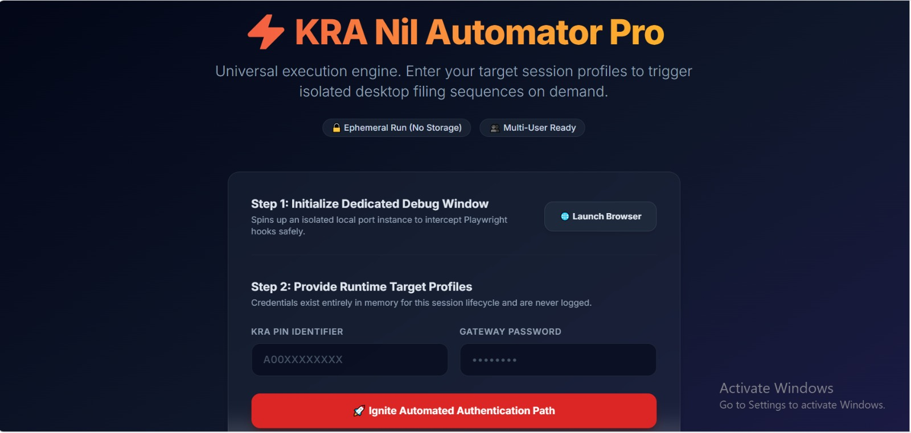
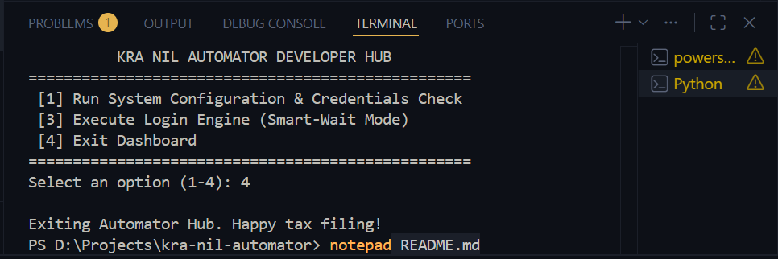
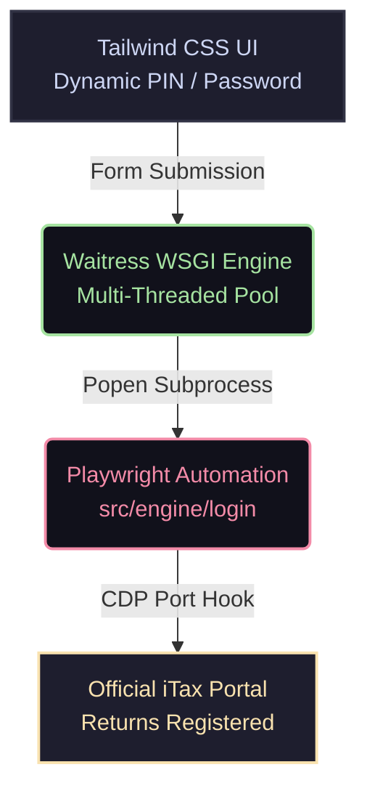

# ⚡ KRA Nil Automator Pro

An industrial-grade, multi-user automation engine designed to orchestrate ephemeral browser sessions for filing continuous Nil tax returns. Built with a sleek Tailwind CSS web interface and backed by a robust production WSGI server, this platform operates with zero credential storage—ensuring absolute privacy and data sovereignty.

---

## 📸 System Interface Overview

<table width="100%">
  <tr>
    <td width="50%" align="center">
      <b>🖥️ The Multi-User Control Center</b>
      <br><br>
      
      <br>
      <sub>An elegant, centralized dark-mode workspace where users inject execution targets into memory dynamically.</sub>
    </td>
    <td width="50%" align="center">
      <b>⚙️ Automated Execution Pipeline</b>
      <br><br>
      
      <br>
      <sub>Monitors the physical browser engine attaching to local debug ports, populating official fields, and awaiting captcha validation.</sub>
    </td>
  </tr>
</table>


*(Note: Replace the placeholder image URLs above with your actual screenshot paths once uploaded to GitHub, e.g., `docs/assets/dashboard.png`)*

---

## 🚀 Key Architectural Features

*   ### 👥 Multi-User Ephemeral Architecture
    Credentials exist purely within volatile runtime memory pools during the active execution thread. No database pipelines, no local `.env` writing, and absolute security isolation.
*   ### 🌐 Hardware-Level Automation
    Leverages native Playwright CDP (Chrome DevTools Protocol) to attach seamlessly to pre-warmed Edge/Chromium contexts, bypassing aggressive anti-bot layout overlays.
*   ### ⚡ Industrial WSGI Core
    Driven by a multi-threaded Waitress production web server capable of handling concurrent multi-user requests without blocking execution threads.
*   ### 🧠 Assisted Captcha Handoff
    Automates 95% of the navigation, identity data-entry, and password injection, pausing gracefully for exactly 12 seconds to let the human operator input the custom arithmetic verification token.

---

## 🛠️ System Architecture Flow

The chart below outlines the dynamic loop from data entry to official declaration receipt:



---

## 💻 Local Workspace Installation

### 1. Clone & Initialize Environment

```powershell
# Clone the repository
git clone https://github.com/your-username/kra-nil-automator.git
cd kra-nil-automator

# Install production and automation core libraries
pip install flask playwright waitress python-dotenv
```

### 2. Verify Playwright Browser Binaries

Ensure your local system has the required Chromium/Edge components installed:

```powershell
playwright install chromium
```

---

## 🔌 Running the Infrastructure

### 🚀 Production Execution Mode (Industry Ready)
To launch the system inside a multi-threaded web server ready for internal team trials or local area network testing, execute the production wrapper:

```powershell
python prod_server.py
```
Once ignited, navigate your browser to: `http://localhost:5000`

### 🛠️ Developer Debug Mode
If you are modifying backend behaviors or altering UI themes locally:

```powershell
python app.py
```

---

## 🔒 Security Statement

> [!IMPORTANT]
> **This application is strictly ephemeral.** It does not possess a persistent database component, state registry machine, or remote tracker analytics. When a user executes the engine, their credentials are transferred securely via local HTTP POST methods directly to the operating system's command execution flags, passing instantly to the browser session and evaporating entirely upon task completion.
